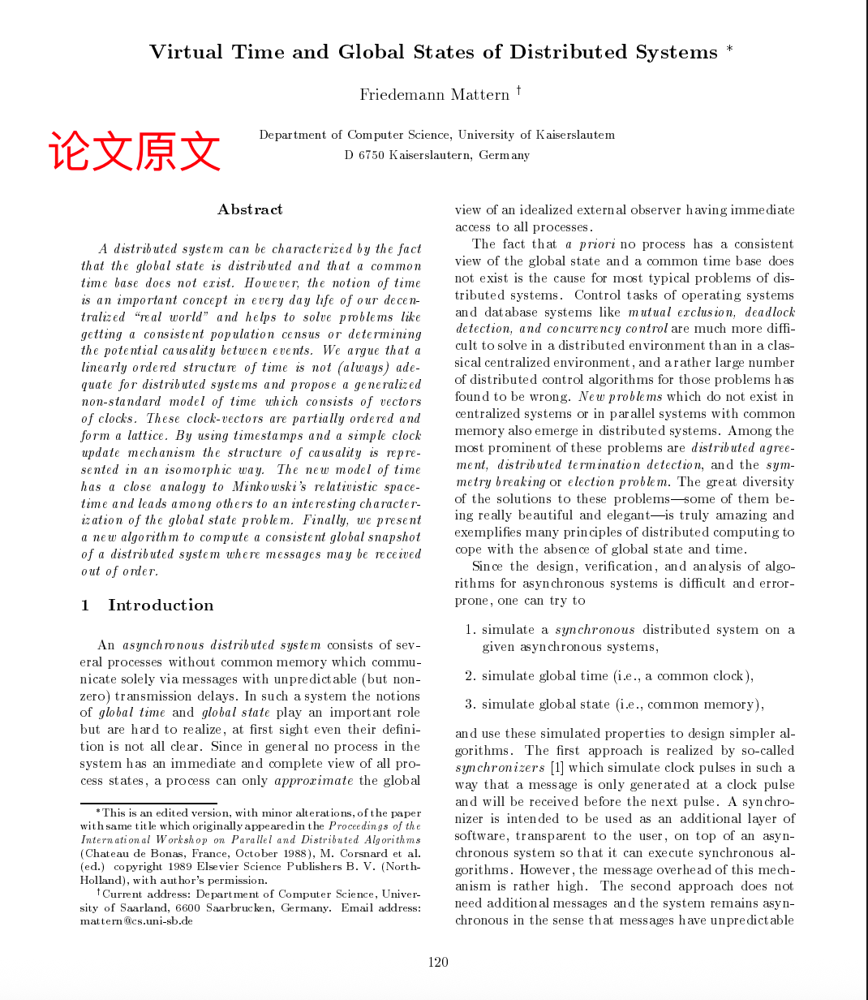
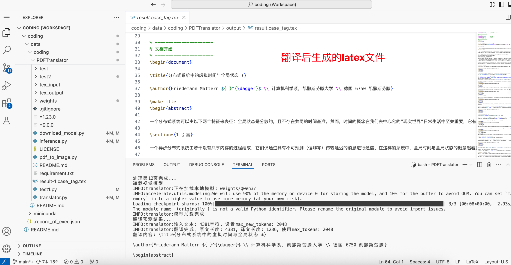
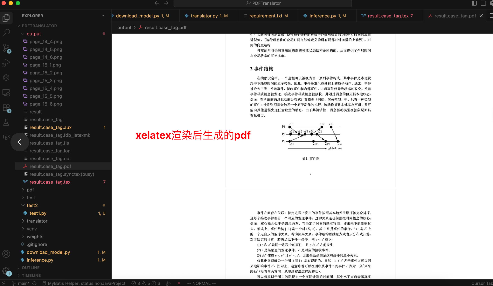

# README.md
本项目旨在将英文PDF学术论文翻译成中文latex格式文件, 为使用者提供更好的论文阅读体验.

## 项目介绍

本项目翻译pdf整体分为三个阶段

1. pdf图片化处理
2. 视觉模型图片解析, 生成latex文本
3. 语言模型文本内容翻译

1阶段, 通过PyMuPDF将pdf导出为图片数据, 并在项目结束运行后自动删除所有创建内容

2阶段运行Qwen2.5视觉模型, 解析图片数据并返回 html + latex混合的文本数据. 其中html囊括文本在原pdf中的坐标信息, 该座标需要缩放还原得到原本坐标信息. 当模型解析完成后, 程序会去除html标签信息, 并对部分内容额外处理

3阶段开始前会卸载2阶段加载模型, 释放占用显存, 随后加载Qwen3文本模型, 执行翻译工作. 模型翻译时会尽可能保留latex公式, 只翻译文本内容. 执行完成后则输出并写入最终latex翻译文件

## 开发环境

python 3.10

torch 2.5.1

cuda 11.8

flash-attention >= 2.4.2 [可以不下载]

显存 24G为最佳, 计算能力最好8.0以上(否则attention机制无法使用`flash_attention_2`, 只能使用`sdpa`')

## 项目启动

```python
# 下载必要的python依赖
pip install -r requirement.txt
```

```python
# 下载模型
python download_model.py
```

```python
# 执行推理
python inference.py \
    --model_path weights/Logics-Parsing \
    --translator_path weights/Qwen3 \
    --output_path 输出路径, 需要指定文件名 \
    --pdf_path 输入pdf文件路径
    --attn flash_attention_2
```

需要额外解释的是
- --model_path 输入的是download_model下载的第一个模型, Qwen2.5视觉推理模型所在路径
- --translator_path 输入的是download_model下载的第二个模型, Qwen3文本推理模型所在路径
- --output_path 指定输出路径, 例如output/result, 表示翻译内容最终会在output目录下写入`result.case_tag.tex`文件, 其中`result.case_tag.tex`是对result进行额外处理后得到的文件名
- --pdf_path 输入pdf路径, 改参数可以修改为--image_path, 输入单个图片. --pdf_path/--image_path选择其一即可
- --attn 指定视觉模型推理时的注意力机制实现逻辑. 可选择不填, 默认`sdpa`. 如果想要指定`flash_attention_2`, 必须下载`flash-attention>=2.4.2`. 但flash-attention下载需要本地编译, 可以从`https://github.com/mjun0812/flash-attention-prebuild-wheels/releases`网站选择下载适合自己配置的已经编译完成的whl文件, 然后执行pip install [预下载的whl文件]即可完成安装

## 推理结果
项目会将大模型推理得到的数据写入 --output_path指定的文件目录之下. 用于只需用寻找对应的.case_tag.tex后缀的文件即可. 如果output_path目录下还有图片, 请不要删除, 否则后续pdf编译则无法正常获取图片

针对tex文件, 需要用户手动用latex进行编译, 具体指令为`xelatex [指定的.tex文件]`.

## 效果

论文原文


翻译结果


pdf预览
